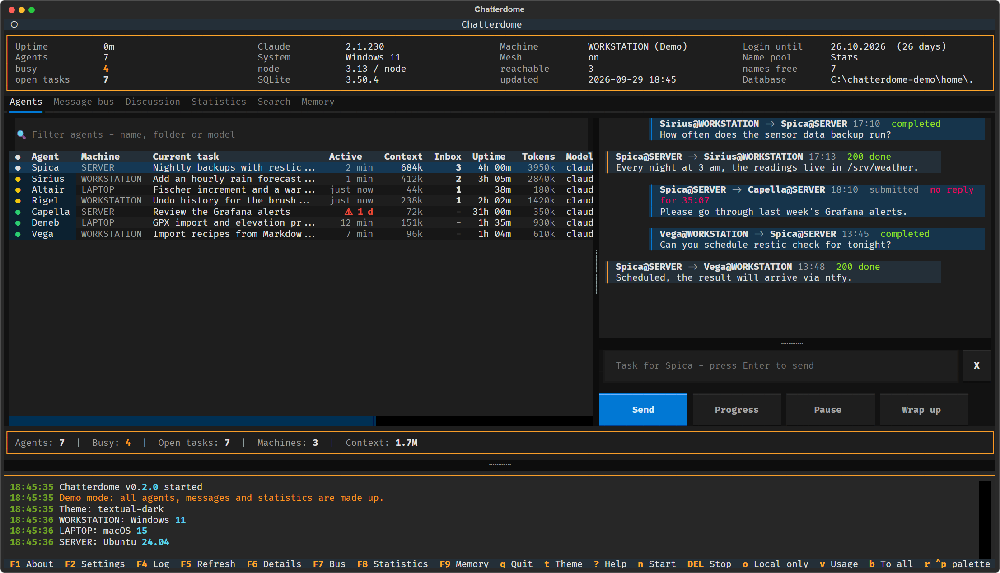
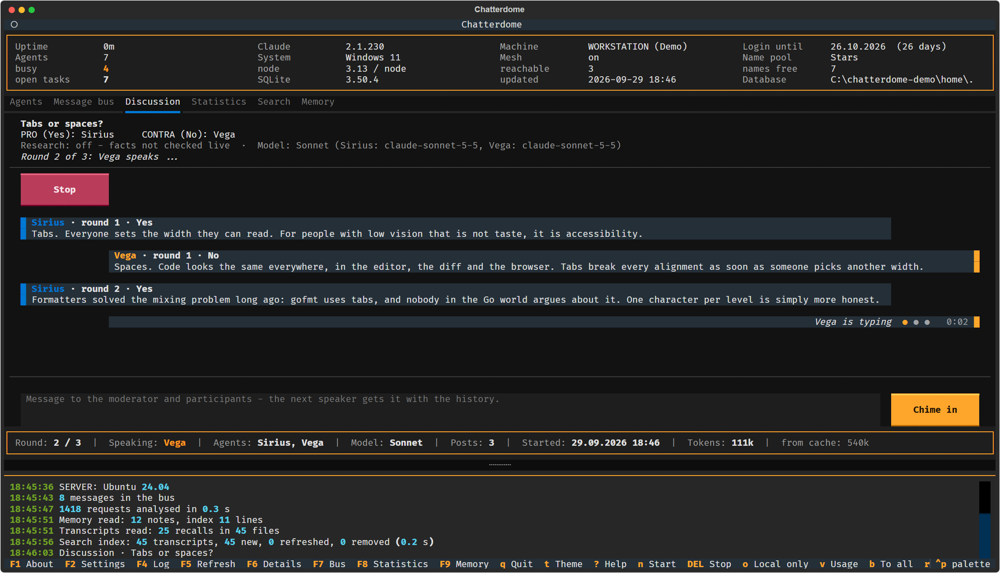
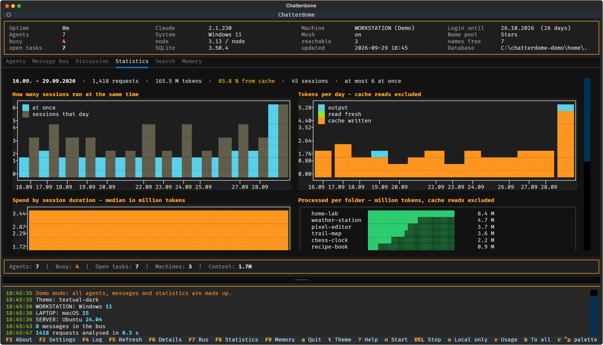
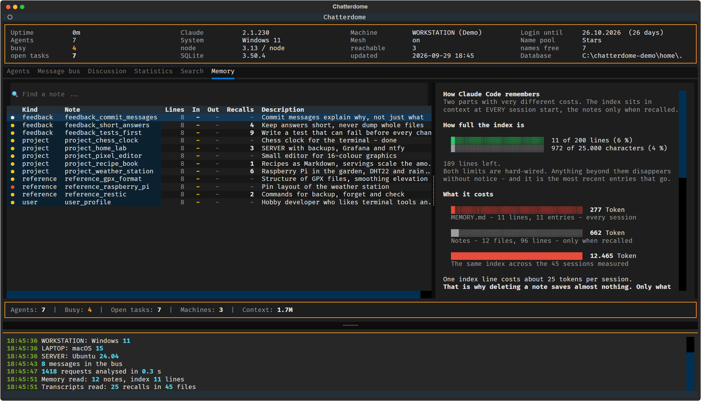
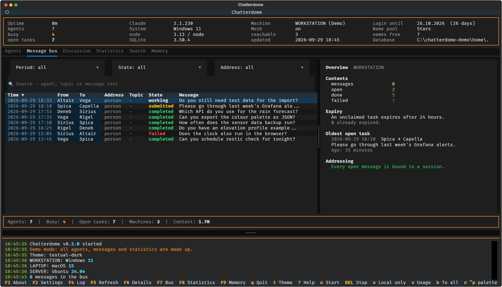
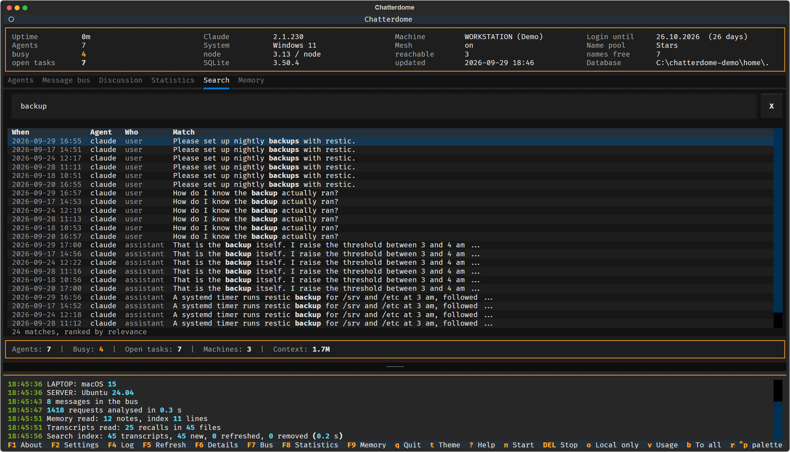
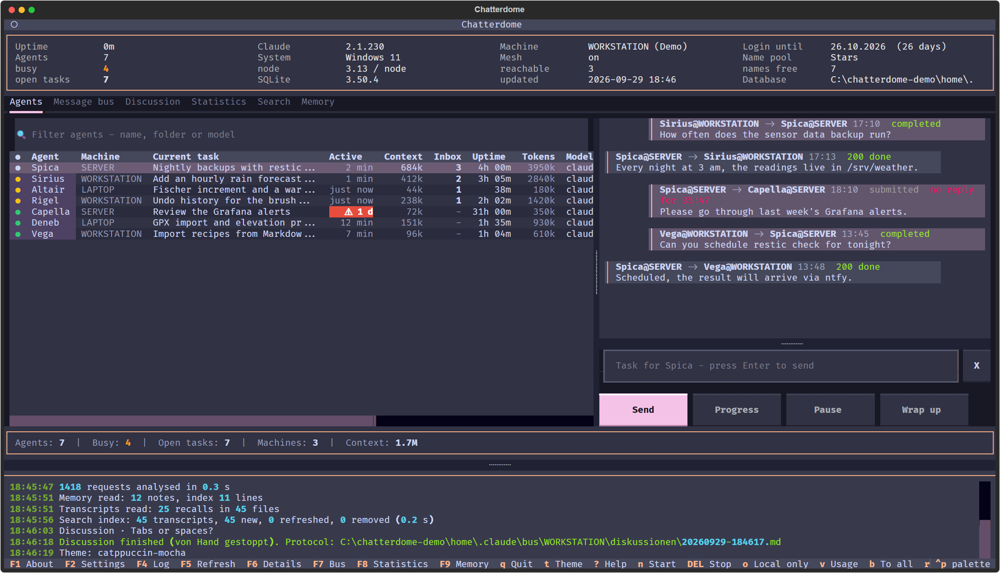

# chatterdome

<p align="center">
   <b>English</b> ·
   <a href="README.de.md">Deutsch</a>
</p>

---

<p align="center">
  
  <br>
  <sub>This banner is AI-generated (Google Gemini) and carries its signed C2PA manifest
  (<code>trainedAlgorithmicMedia</code>).</sub>
</p>

A control room for Claude Code. It shows every session running on your machines, gives each one
a name, lets them hand each other tasks, and tells you what they cost, what they remember and
how full their context is. And it lets several agents debate a question until there is a
decision.

Everything stays **on your own machines**. No service, no open port, no cloud account, no
telemetry. What crosses machine boundaries goes over SSH inside your own Tailnet.

> **A playground.** Chatterdome is an experiment to get to know Claude Code better: what it
> writes into its transcripts, how its memory works, what a session really costs, and how
> sessions can talk to each other. Some of it is polished, some of it is a first attempt. Expect
> rough edges, and read [Limits](#limits) before relying on it.

<p align="center">
  
  <br>
  <sub>All screenshots come from the built-in <a href="#demo-mode">demo mode</a> with made-up data.</sub>
</p>

## Features

- **Every agent gets a name.** Sessions are addressed as `Vega` or `Vega@LAPTOP` instead of a
  process id. The name shows up in the terminal tab, in the table and in every message.
- **Name pools you can extend.** Four themes are shipped: saints, actors, stars and singers.
  Your own themes go into a local file that git ignores, see [Agent names](#agent-names).
- **Across machines with Tailscale.** One table for the sessions on all your machines. Send
  tasks to an agent on another machine, restart a session there (the conversation stays),
  update Claude Code remotely and take a screenshot of a remote screen. All of it runs over SSH
  inside your Tailnet.
- **Visual warnings.** A context above 600k tokens turns yellow, above 800k it blinks red. A
  session that has done nothing for 24 hours gets a blinking ⚠ in the activity column.
- **Memory analysis.** How full `MEMORY.md` is against its hard limits, what the index costs in
  every session, broken links, notes missing from the index, and how often each note was
  actually recalled.
- **Context and token analysis.** Context and tokens per session, what was processed per day and
  per folder, and how much of it came from the cache.
- **Statistics and cost control.** How many sessions ran at the same time, spend by day, folder
  and session length, and an early warning for the message bus. Discussions count their tokens
  live, and the model (Haiku, Sonnet, Opus) is chosen per discussion.
- **Discussions and debates.** Several agents argue PRO and CONTRA or work as a team towards a
  decision, optionally after a research round on the web. You can chime in while it runs,
  continue it later with new information or another model, and every discussion lands in an
  archive. The name of this app was found this way.
- **Full-text search** across all transcripts of Claude Code and the Codex CLI.
- **A message bus** between sessions, with state, receipts and expiry.
- **Theming.** 62 themes, `t` cycles through them.
- **SQLite as storage.** The message bus, the search index and the discussion archive are local
  SQLite files. No database server.
- **macOS, Linux and Windows.** Tested on Linux and Windows in CI, release builds for all three.
- **Demo mode** with made-up data for screenshots and presentations.

## Screenshots

<table>
  <tr>
    <td width="50%"><br><sub>A discussion in progress</sub></td>
    <td width="50%"><br><sub>Statistics</sub></td>
  </tr>
  <tr>
    <td><br><sub>Memory analysis</sub></td>
    <td><br><sub>Message bus</sub></td>
  </tr>
  <tr>
    <td><br><sub>Full-text search</sub></td>
    <td><br><sub>One of 62 themes</sub></td>
  </tr>
</table>

## Installation

You need:

- [Claude Code](https://docs.anthropic.com/en/docs/claude-code)
- Python 3.12 or newer and [uv](https://docs.astral.sh/uv/)
- Node.js 22 or newer (the message bus uses the built-in `node:sqlite`)
- git
- For the mesh: [Tailscale](https://tailscale.com/) and SSH access between your machines

```bash
git clone https://github.com/michaelblaess/chatterdome.git
cd chatterdome

./setup.sh          # links the skills, installs the chatterdome command
./bootstrap.sh      # creates .venv and installs the Python part
./run.sh            # starts the interface
./run.sh --demo     # the same with made-up data
```

On Windows the same scripts exist as PowerShell:

```powershell
powershell -ExecutionPolicy Bypass -File setup.ps1
powershell -ExecutionPolicy Bypass -File bootstrap.ps1
.\run.ps1
```

`setup` points `~/.claude/skills/operator` and `~/.claude/skills/claude-bus` at this repo and
puts the `chatterdome` command into `~/.local/bin`. Nothing changes for Claude Code, the skills
stay exactly where it expects them. An existing real directory is **never deleted**, it is moved
aside as `.vor-chatterdome`. On first start the interface asks you to accept a notice: agents,
discussions and research run on your Claude account and cost tokens.

**Across machines:** copy `skills/operator/mesh.example.json` to `mesh.json` and list your
other machines. The names have to be reachable via `ssh <name>`, typically through
`~/.ssh/config` inside your Tailnet. Without `mesh.json` everything stays on the local machine,
which is not an error. `chatterdome status --mesh` shows whether the other machines answer.

### Moving from claude-sanctuary

Until 29.09.2026 the project was called **claude-sanctuary**. A machine with the old clone moves
over in two steps. First close everything running inside the folder (Claude sessions, the old
TUI, terminals), then run from the old folder:

```bash
git pull
bash scripts/umzug-chatterdome.sh                                   # Linux, macOS
powershell -ExecutionPolicy Bypass -File scripts\umzug-chatterdome.ps1  # Windows
```

The script renames the folder to `chatterdome`, updates the git remote, rebuilds `.venv` and
runs setup and bootstrap. Settings, search index and discussion archive are copied from
`~/.claude-sanctuary` to `~/.chatterdome` on first start. The old `sanctuary` command stays
as an alias: other machines call it over ssh, and their state may be older than this one.

## Limits

- **It is a playground.** Chatterdome reads files that Claude Code writes for itself. When
  their format changes, parts of it can break until they are adjusted.
- **The chat is not a terminal.** A message from the agents tab reaches the session as a task
  on the message bus. Slash commands such as `/compact` cannot be sent that way, they have to
  be typed in the session's own window.
- **Starting and stopping only work on the local machine.** Across the mesh you can send
  tasks, restart a session, update Claude Code and take screenshots, but not start or stop an
  agent.
- **On Windows a task waits for the next reply.** macOS and Linux deliver it right away through
  a socket, see [Instant delivery](#instant-delivery).
- **The statistics are a lower bound.** They only know the transcripts that still exist.

## A web version is on its way

A browser interface is in the works and not public yet. Its goal is to do everything the
terminal version cannot, starting with a real terminal for every agent in the browser, so that
`/compact` and every other command work from there as well.

---

The sections below go into detail.

## Parts

| Part | What it does |
|---|---|
| `skills/operator` | Overview of running sessions: name, status, folder, model, uptime, context. Detail view, live view, stop, cross-machine view |
| `skills/claude-bus` | Tasks between sessions, with state and receipts. SQLite, append-only events |
| `kern/gedaechtnis.py` | Memory analysis: index versus collection, links, checks, actual recalls from the transcripts |
| `kern/busansicht.py` | Selection and figures for the bus tab: period, state, address kind, free-text search |
| `kern/transkripte.py` | Where the transcripts live and how to read them: Claude Code including subagents, Codex CLI. One source for statistics and search |
| `kern/suche.py` | Full-text index across all transcripts, SQLite with FTS5, incremental via file time |
| `kern/statistik.py` | Analysis of transcripts and bus: fleet, spend by kind, session duration, early warning |
| `kern/` | UI-free Python core, kept apart from the interface |
| `tui/` | Textual interface for the terminal |

## Command line

Setup installs a `chatterdome` shortcut into `~/.local/bin` covering both skills:

```bash
chatterdome status              # table of all sessions
chatterdome status --mesh       # include the other machines
chatterdome status --json       # machine readable
chatterdome watch 2 --json      # NDJSON stream for tooling
chatterdome start [name]        # new session, named in the tab title
chatterdome stop <name>         # end a session

chatterdome send Klara "Please run the tests" --erwartet-quittung
chatterdome auftraege           # what is waiting for me
chatterdome ack <id> 200 "done"
chatterdome hilfe               # all commands
```

The scripts can still be called directly
(`node ~/.claude/skills/operator/operator.mjs status`), but that is only needed for debugging.

### Demo mode

`chatterdome-tui --demo` starts the interface with made-up data only: seven agents on three
machines (WORKSTATION, LAPTOP, SERVER), a filled message bus, two weeks of statistics, memory
notes, an archive of discussions and a discussion that plays itself out when you start one. It
reads nothing from your real `~/.claude` and starts no sessions, which makes it the right tool
for screenshots and presentations. The header says `(Demo)` the whole time.

The demo lives in `C:\chatterdome-demo` (Windows) or `/tmp/chatterdome-demo` and is recreated
on every start, `CHATTERDOME_DEMO_DIR` points it elsewhere. `--lang en` or `--lang de` picks the
language of the content as well.

## Agent names

Every session gets a name from a pool, so you can address it instead of a process id.
`skills/operator/namenspool.json` holds several themes and remembers which one is active.
Shipped are four themes: `heilige` (catholic saints), `schauspieler` (actors),
`sterne` (stars) and `saenger` (singers). The people themes use plain first names only.
Adding your own theme is one more entry under `pools`.

Themes made of characters from a copyrighted work are deliberately **not** shipped. A plain
list of names looks harmless, but naming the work in `motiv` establishes the reference, and
rights holders do act on it: well-known comic characters are covered by EU trademarks in
class 9 (software), and in 2016 rights holders had two GitHub repositories taken down in full.

A themed pool is still half the fun, just keep it local: your own themes go into
`skills/operator/namenspool.local.json`, which git ignores. For a theme in the repository,
use anything that is nobody's property: constellations, birds, trees, rivers, minerals.

## The message bus tab

Press `u` in the interface. On the left a table of every message in this
machine's bus, on the right either the overview or the selected message with all
its receipts. Three dropdowns filter by period, state and address kind, plus a
search field covering agents, topic, body and receipt notes. Clicking a header
sorts, `Esc` leaves the detail view.

The **address** column is the interesting one, and it has a reason. On
07.08.2026 the interface posted a task to an instance called Marga. That Marga
never picked it up, its session ended, the name went back into the pool - and
four days later a completely different session received the same name and worked
the task. A name is a lease, not a person.

Since then the bus distinguishes two kinds of address:

- **Person** - the task is bound to the session that held the name when it was
  sent. A later holder does not receive it.
- **Role** - the task means the name, whoever holds it. Chosen explicitly
  (`--rolle`), and defensible only together with expiry.

So the overview does not just count open, done and failed, it also states **how
many open messages can still be inherited at all**. That number would have
predicted the incident. Next to it the expiry deadline (24 hours by default,
changed via `chatterdome config`) and the oldest task still open, with its age.

This tab is read-only as well. Sending still happens in the agents tab.

## The statistics tab

Press `k`. A dashboard of six sections, drawn with plotext in the terminal.
The numbers come from the transcripts under `~/.claude/projects` and from the
bus. A full pass over 369 MB takes a measured 2.3 s with a warm file cache,
about 7.6 s on the first run after startup. Both are fast enough for the tab to
recompute on every open rather than keep a cache that can go stale.

- **Concurrency** - how many sessions were active at the same time on a given
  day, at most, next to how many there were in total. Reconstructed
  retroactively from the session intervals; nothing ever had to be recorded.
- **Processed per day** - tokens by cache write, fresh reads and output,
  stacked. Cache reads are deliberately absent: they account for a measured
  **96 to 98 percent** and would turn the chart into a single-colour bar. As
  one number they sit in the header, where they say more.
- **What length costs** - median spend per bucket of session duration. Median
  rather than mean, because a single very long session would otherwise define
  its bucket on its own.
- **Processed per folder** - a list with text bars, one row per folder. Same
  measure as above, so cache reads excluded: with them one folder alone would
  read almost two billion tokens, and two adjacent charts would mean two
  different things.
- **Message bus** - tasks per day by outcome, plus how long the open ones have
  been waiting.
- **Early warning** - four numbers with a traffic light, among them the one
  that would have predicted the incident of 07.08.2026: how many open messages
  a later holder of the same name could still inherit.

**Everything is aggregated per session, never per agent name.** A name is a
lease - in the measured period four names had already served two different
sessions each. A ranking by name would merge them, and that is the same
mistake that delivered the bus task to the wrong Marga.

Two limitations appear as a footnote in the tab, because they shape the
figures: what is measured is the **active** span, first to last request - not
how long a window stayed open.

**Subagents have been counted since 24.08.2026.** This section used to say
their share was not measurable - `isSidechain` is false for 35,498 of 35,498
requests in the main transcripts. That is true but misleading: subagents live
one level deeper, under `<project>/<session>/subagents/*.jsonl`, and there the
field is true. The glob never reached that level. Measured on 24.08.2026: 255
requests against 14,608 in the main body - 1.7 percent of requests and 1.3
percent of output tokens. They count towards the parent session, since their
`sessionId` is the parent's. The header line lists them separately whenever the
period contains any. The agent type and a readable task description live in a
`*.meta.json` next to the file.

**One assistant turn spans several lines**, and each repeats the same cumulative
usage. Until 24.08.2026 the analysis summed per line and counted it several
times - measured factor 2.25, i.e. 30.45 instead of 13.51 million output tokens.
Since then it counts only the last state per `requestId`. **All figures in the
statistics tab have shrunk accordingly and are not comparable to earlier
snapshots.**

## The search tab

Key `f`. Full-text search across all transcripts - Claude Code and Codex CLI -
using SQLite with FTS5. The index lives at `~/.chatterdome/suche.db` and
is disposable at any time: it holds nothing that is not also in the
transcripts.

Measured on 24.08.2026: 98 transcripts with 7,600 passages, initial
build **1.8 s**, index 22.9 MB. Every later run only compares modification
time and size per file and finishes in **0.01 s**. A query takes 1 to 2 ms,
which is why the tab searches as you type instead of asking for Enter.

Two things the index deliberately does not do:

- **Tool calls and their output stay out.** They make up most of the
  characters, and what is in them - file contents, command output - is better
  found where it came from. The search covers what was said.
- **Results are ranked by relevance, not by date.** Whoever searches wants the
  best match. A list sorted by date would answer a different question.

Diacritics are folded, so `koln` finds `Köln`. The sharp s is untouched:
`grusse` does not find `Grüße`. Enter on a result opens the transcript in the
associated program.

## The memory tab

Press `m` in the interface. The tab reads the notes under `~/.claude/memory`
and shows what Claude's memory actually costs. The path can be changed in the
settings for anyone keeping a separate directory per project.

The most urgent figure sits at the top: **how full the index is.** `MEMORY.md`
has a hard limit of 200 lines or 25,000 characters, whichever bites first.
Anything beyond that is **silently truncated** at session start, and it is the
most recent entries that go. No setting lifts it. The tab shows both limits as
bars and warns from 80 percent.

Memory comes in two parts with very different costs:

- **`MEMORY.md`** is the index and sits in context at **every** session start.
  Every line in it costs in every future session.
- **The individual notes** only cost something when recalled, and that is rare.

The overview puts those two numbers side by side, along with the index
projected across the sessions measured. The practical lesson follows from
that: deleting a note saves almost nothing, while one line less in the index
does. Merging beats deleting.

The checks look for demonstrable defects rather than offering opinions: notes
missing from the index, index entries without a file, links pointing nowhere,
missing type fields.

How often a note was **actually** recalled is read from the transcripts. Only
the recall marker Claude Code places before a loaded entry is counted. Simply
searching for the file name would be worthless, since it also appears in every
`git diff` output. The figure is a lower bound: only what the surviving
transcripts contain is counted.

The tab is strictly read-only. It changes and deletes nothing.

## SSH: interactive versus one-shot

A difference that catches everyone once:

```bash
ssh server                         # interactive login shell - everything as usual
chatterdome status                   # simply works there

ssh server "chatterdome status"      # NOT found
ssh server 'bash -lc "chatterdome status"'  # this works
```

Reason: `ssh host "command"` does **not** start a login shell. Ubuntu bails out in the first
lines of `.bashrc` when the shell is not interactive, so `~/.local/bin` never reaches the PATH.
On **Windows** it is the other way round: sshd hands over the PATH from the registry, so the
direct call works - but `bash -lc` lands in **WSL** instead of Git Bash, where there is no node.

**Daily work is unaffected** - grabbing a console with `ssh server` never notices any of this.
Only scripts issuing commands over SSH are, which is why `--mesh` tries both ways.

## New skills

`~/.claude/skills` holds one symlink **per skill**, not one for the whole directory. That is
what allows skills from several repos, but it has a price: a newly added skill does not show up
on its own after a `git pull`.

The `session-sync-check.sh` SessionStart hook from `claude-config` takes care of that - it
creates missing links at the next session start and reports them (`Neue Skills verlinkt: ...`).
Anything already linked is never touched, so skills from this repo stay untouched. If you
cannot wait, run `setup.sh` again - it is idempotent.

**On Windows targets setup also adds a PATH entry.** Without `~\.local\bin` in the **user**
PATH your own shell finds the shortcut, but `status --mesh` fails - the Windows sshd hands
exactly that user PATH to incoming connections. The entry is only appended, never replaced.

## Two classes of agents

The central design decision, because it explains what this tool deliberately **cannot** do:

For a long time a running **interactive** Claude session had no external inbox. A new turn only
ever started from user input - an architectural boundary of Claude Code that no transport could
work around, neither a terminal trick nor HTTP.

**On macOS and Linux that stopped being true with Claude Code 2.1.224.** Every session binds a
Unix socket there that accepts writes from outside, and the bus uses it - see
[Instant delivery](#instant-delivery). On **native Windows** the boundary still stands.

The split into two classes remains useful regardless:

- **Interactive sessions** are your working windows. They are **observed**, not driven. On
  macOS and Linux a task reaches them right away, on Windows it waits for the next stop hook.
- **Task agents** are started on demand (`claude -p`, headless), do one job and are gone.
  Those are remote controllable, that is their whole point.

## Instant delivery

A task lands in the waiting session directly instead of sitting there until its next reply.
Controlled by the `zustellung` setting:

| Value | Behaviour |
|---|---|
| `auto` | Default. Straight through the inbox socket where one exists (macOS, Linux), stop hook otherwise. |
| `socket` | Instant only. If it fails you get a warning - the task is still queued. |
| `stop-hook` | Always the previous route. The only one available on Windows anyway. |

```bash
chatterdome bus config zustellung socket
```

**Prerequisite:** `~/.claude/settings.json` needs `"crossSessionInbound": "accept"`. Without it
a session running in bypass mode holds every outside injection for approval and shows a dialog
instead. On Windows the setting does nothing and does no harm.

Across machines the route is unchanged: ssh inside the tailnet. Only the last metre on the
target machine becomes instant, because that is where the socket lives - the sender cannot
know it.

### The same name on two machines

A name is a lease **per machine**. `Petra` can run on WORKSTATION and SERVER at the same time - both
sessions are real and have their own IDs. What has to be unambiguous is not the name but the
address:

```bash
chatterdome send Petra@SERVER "..."
```

While the name is unique across the mesh, plain `send Petra` keeps working. Once it is not, the
bus stops and names both variants instead of silently picking one. The table renders such names
as `Petra@WORKSTATION`, and `chatterdome bus doctor` lists them.

### Stale sessions

A session that is running but has done nothing for 24 hours gets a red `⚠` in the activity
column. Its traffic light stays green - the session **can** take tasks, it just isn't doing
anything. The mark sits where the evidence sits.

### Two traps

⚠ **The first session after a Claude Code update does not get the feature.** Its feature flags
have not been fetched yet, so the session binds no socket. Restarting that session fixes it.
After an update, restart once before concluding instant delivery is broken.

⚠ **`/list-agents` is not a usable check** for whether the feature is on, even though
Anthropic's documentation suggests it. The command is recognised without the feature too and
then merely reports "No subagents or other Claude sessions", because it also lists subagents.
What holds up is the `Peer address` row in `/status`, and `ss -xlp | grep cc-socks` from
outside. A re-test is planned for late August 2026.

## Where the code came from

Operator and message bus moved here from the private `claude-config` repo, state `3a531c4` of
2026-08-01. Their history stays there - it starts fresh here, because the old commits almost
always touched several skills at once.

## License

Apache-2.0, see [LICENSE](LICENSE).
